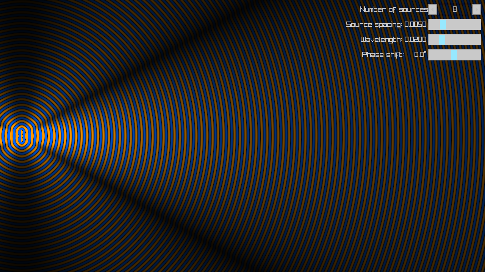
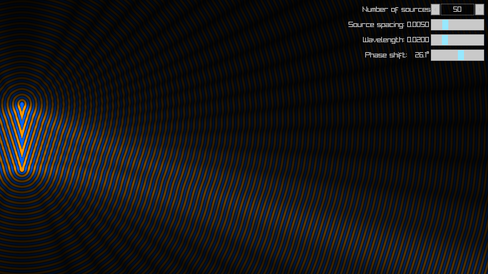

# phased_array

An interactive simulation of a phased array.





## Build

From the root directory of this cloned repository:

```
cmake -S . -B build -DCMAKE_BUILD_TYPE=Release
cmake --build build
./build/phased_array
```

## External libraries

- [raylib](https://www.raylib.com/index.html)
- [raygui](https://github.com/raysan5/raygui)

## License

This software is released under [MIT License](LICENSE).

